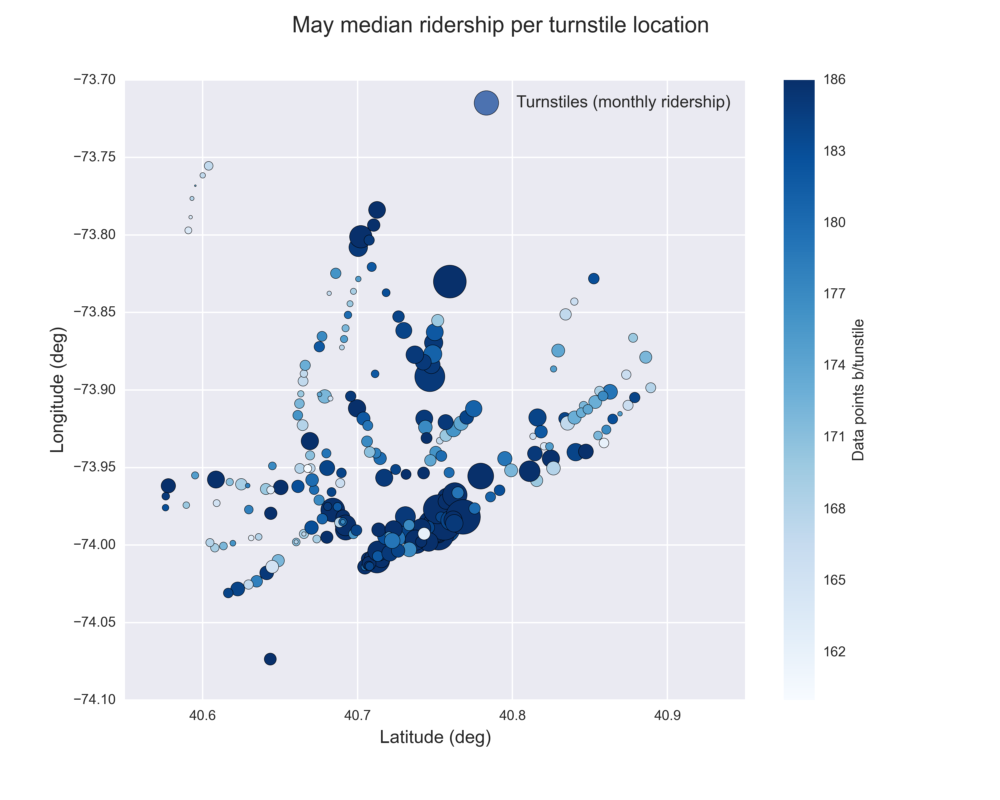

********
Overview
********

This project consists of two parts. In Part 1 of the project, we have completed
the questions in Problem Sets 2, 3, 4, and 5 in the Introduction to
Data Science course.

This document addresses part 2 of the project, where we answer a set questions
to explain our reasoning and conclusions behind our work in the problem sets.

The main purpose of the project is to analyze the ridership behavior for the
New York City subway. The dataset used contains a sample taken from the month
of May 2011, using the publicly available turnstile data from
`MTA <http://web.mta.info/developers/turnstile.html>`_. The turnstiles in
different stations of the system report the absolute number of entries and exits
at certain hours for a given time interval. The improved dataset that we use
reports the number of entries for time intervals of 4 hours, so it present us
with 6 daily reports by turnstile.

   Turnstiles' locations within NYC, from the improved dataset.

Besides the information provided by the NYC subway, the dataset also includes
weather information taken from several weather stations within the NYC area:
each turnstile, depending on the location in NYC, is merged with the weather
information of the closest weather station, thus providing temperatures, wind
speed, pressure, conditions, precipitations, etc.

The project focuses one main question: Does the weather conditions, specifically
precipitations, affect the NYC subway ridership? To answer this question we
will use exploratory tools, statistical tests and visualizations. Also, we will
try to fit a model to the data by choosing certain predicting features; will
the use of the precipitation variable improve the fit?

Supporting Material
===================

Within the project github repository you will also find an ipython notebook,
where most of the work done was recorded for reference.

Some remarks about the datasets used
====================================

For this project we use the data set provided at Data Analyst Nanodegree's
portal for Project 1. The description of the variables can be found on...

However, after the exploratory and data analysis, we created another dataset by
further munging the improved dataset. The basic idea was to smooth out features that
might be caused by individual turnstiles or measurements. To do this, I
grouped the data by time stamp and aggregated the entries by hour by adding all
the entries. Also, the precipitation information for each
time stamp was included by means of two columns:

* ``rain_hour``: indicator (0 or 1) for precipitations for the particular date
  date and time. It is 1 if for any of the stations the conditions were Rain,
  Light Rain, Hard Rain or Light Drizzle at that moment.

* ``rain_day``: indicator (0 or 1) for precipitations for the particular day
  of the report. If at any station of our turnstiles the conditions reported
  precipitations during the day the value is set to 1.
