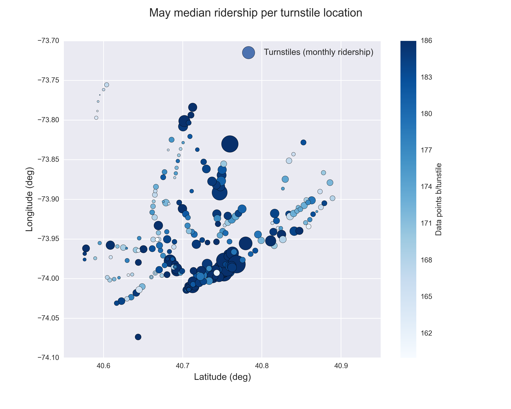
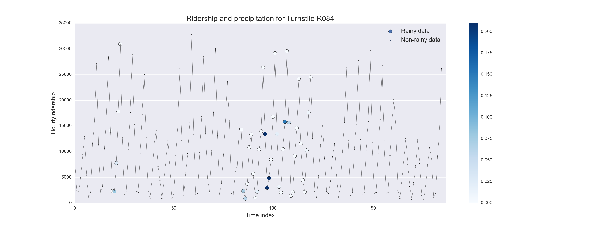

****************
Statistical Test
****************

In lecture 3 and its problem set, the following question was given *Do rainy*
*days affect the ridership of the NYC subway?* To answer this problem we began by
 creating two samples from our data:

* Sample A (`No rain`) is a subgroup containing the entries where no rain was reported, using the
  information of the `rain` variable (:math:`rain = 0`)
* Sample B (`Rain`) is a subgroup with the entries where some precipitation was reported
  by means of the `rain` variable (:math:`rain = 1`)

By studying the distributions, using histograms, we were able to characterize
both data samples. We found out that both samples have a similar shape, clearly
not normal, and positively skewed (:ref:`figure 2.1 <figure21>`).

.. _figure21:
.. figure:: samples_compared.png
   :scale: 75%
   :align: center

   Ridership distribution comparison between rainy and dry days.

   Please note the logarithmic scale on axis Y. It was used to allows us to study
   the visualization with more detail.

Because of the non-normal distribution we decided to use the median as measure
of average for the samples:

* Sample A, days without precipitation, show a **median ridership of**
  **901 passengers per hour.**
* Sample B, rainy days, report a **median of 945 passengers per hour.**

To assess the significance of this result, that rain seems to increase ridership
in the NYC system by a small amount, we will use a non-parametric test.

Statistical Test Used
=====================

The Mann Whitney U test is chosen to assess the statistical significance of this
result. The null hypothesis in our case is that both populations are equal, or
that there is no significant deviation on both populations medians (two-tailed
hypothesis).

Justify the Statistical Test
============================

The Mann Whitney U test, or Wilcoxon rank-sum test, is chosen because of
characteristics of our samples: we can't use a parametric test because the
distributions do not seem to follow any particular and well known probability
distribution which we could use to make inferences that could directly report the
significance of any difference between both populations.

The U test is particularly powerful to assess the significance of the difference
between the median of two samples that have similar distributions. The assumptions
that our data samples must comply with are basically:

* All observations of both groups are independent
* The responses are ordinal (so we can use the ranking algorithm of the U test).

Results
=======

We used the scipy implementation of the Mann Whitney U test
(scipy.stats.mannwhitneyu). The results from the test are:

* :math:`U = 150678745.0`
* :math:`p = 1.91 \cdot 10^{-6}`

But the user should be aware that scipy reports p-value for a one-tailed
hypothesis, so we multiply by 2 to get the significance for our hypothesis:

* :math:`p = 3.82 \cdot 10^{-6}`

Interpretation and discussion
=============================

The interpretation, given the result from the U test, is that the the ridership
is not the same for rainy days than non-rainy days, with a significance higher
than 95% (p < 0.05). Furthermore, from the descriptive statistics of our samples
we can conclude that the ridership tends to be higher in rainy days.

However we have limited ourselves here to follow the procedure suggested by the
lectures, assuming that observations of both groups are independent and there
no other factors that might wrongly induce this result. Even when the data sample
we use for the project has been through a more complete wrangling, there are
still some issues that might affect the results:

* There is missing data for several turnstiles. From the original sample of 240
  turnstiles, only 52 have complete data for May; also, as discussed on the forums,
  some precipitation data is missing from some weather stations.

* We are using the variable `rain` to create our samples: this variable
  indicates if the conditions at anytime of the day at a
  particular turnstile were rainy. Is it the appropriate variable to use to
  build the subgroups?

* There is one day which was a holiday (Monday 30th), should the data from this
  day be discarded?

Let's look with more detail at some these problems.

Missing data and precipitation distribution
-------------------------------------------

.. _figure22:

   Number of data points (measurements) by turnstile on project's improved
   dataset.

:ref:`Figure 2.2 <figure22>` shows some turnstiles have missing data for the
month of May; with 31 days and 6 daily reports it is expected that a complete
monitored turnstile should have 186 measurements. This is the case for 52 turnstiles,
but 185 turnstiles have a number of measurements between 160 and 185. 3 turnstiles
had less than 160 entries, and after inspections they have been removed because
of the huge amount of missing data or time stamps reporting 0 entries. Of the 185
turnstiles with incomplete data, there was one case where at all time stamps the
number of entries was 0, which was also removed as it does not add any information
to our analysis (even when in other cases it could give further information).

The problem with the missing data is that, for some not clear explanation we
could provide, affects more the suburb stations turnstiles than the ones in downtown
areas. And suburb stations tend also to show lower number of hourly entries, i.e, a
lower ridership, than downtown turnstiles. This effect can be seen in
:ref:`Figure 2.3 <figure23>`.

.. _figure23:

   Turnstiles monthly median ridership, location and number of data points

   The figure shows the distribution of the turnstiles within NYC which are in
   our dataset. The size is proportional to the monthly median ridership (entries
   by hour) while the color indicates the data completeness of each turnstile: whiter
   colors indicate locations with more missing data.

We wonder, as the reader also may, if this missing data could affect in anyway
our previous study. We are not completely sure, but we think that given the way
we performed our analysis it could happen that the results were affected: the downtown
station data, which also correspond to the group of stations with higher ridership,
is contributing to increase the median "entries by hour" that we calculated, as they are
located in the higher values side of the ridership distribution. What happens if
the stations in this locations are also the ones that tend to have more rainy days?
We didn't believe this was the case, but just to be sure we created the
plot shown in :ref:`Figure 2.4 <figure24>`.

.. _figure24:
.. figure:: medprecip_loc.png
   :scale: 75%
   :align: center

   Turnstiles monthly median ridership, location and mean precipitation.

   The figure shows the geographical distribution of the NYC turnstiles in the
   project's improved dataset. Size is proportional to the monthly median ridership
   and color represent the month's mean precipitation per turnstile. The figure
   shows that precipitations are higher in southern (and downtown) NYC.

The figure shows that the precipitation is higher in the northern NYC, which is
also the location of the most busy turnstiles: the median ridership of stations with
higher precipitation (> 0.004 inches) is 1116 entries by hour, while the stations
with lower precipitation (<= 0.004 inches) is 832 entries by hour. Also the stations
with higher precipitation report on average 7 rainy days while the lower precipitation
turnstiles only report 6.

The use of the `rain` variable
------------------------------

The `rain` indicator in the improved data set reports if whether any precipitation
happened at the turnstile location during the day. Because some of the
precipitation data was missing in the weather tables, the conditions
reported in the `conds` variable was used to create the `rain` column (as
mentioned in the forums): if at anytime during a day the condition reported at
a turnstile location was one of the following the `rain` indicator was set to one:
'Rain', 'Light Rain', 'Heavy Rain' or 'Light Drizzle'. This explains why for 94
entries reporting `rain` equal to 1, the `meanprecipi` variable (mean precipitation
for the day at the location) was 0. Also, as shown before, this indicator is different
for each turnstile depending on the closest weather station report. Thus, we
find out that 216 turnstiles report 7 days of rain, 19 turnstiles report 6 rainy
days, and 2 report 5 rainy days. Adding this analysis with the one in the previous
subsection, we have to be aware that the samples might not be completely independent
as previously thought.

Also, there is another important problem derived from the use of `rain`
variable that we hope to make clear with the plot shown on
:ref:`Figure 2.5 <figure25>`.

.. _figure25:

   Ridership, precipitation and rain indicator for turnstile 084.

   The figure show the ridership evolution in May, in terms of entries per hour,
   for turnstile 084, which is on one of the must busy stations in NYC subway.
   There is one point every four hours for the month of May, and the symbols indicate
   whether the day was rainy (big circles) or not rainy (small triangles). Also,
   the precipitation amount in inches for the rainy days is shown by means of the
   color bar in the right, with darker blue colors indication more precipitation.

The problem we see on using the `rain` variable as and indicator of rainy conditions
for a turnstile is that a whole day is tagged as rainy even when only rain at one
time during the day. Furthermore, it can happen, as it can clearly be seen on the figure,
that the rain happened in one of the less busy hours of the day, but still the whole
day data will be tagged as rainy: this will clearly affect the results of our
previous analysis.

Smoothing the data and answering the question again
---------------------------------------------------

In order to smooth out the previously mentioned effects we created a new data
set from where two samples will be created later. For this dataset we grouped
all individual turnstiles data by time stamp, aggregating the ridership
(`ENTRIESn_hourly`) using the `sum` function. In this way we have a set that
represent the behavior of the whole NYC subway as one system, instead of
individual turnstiles, reporting the total ridership at each time stamp. For each
time stamp a variable called `rain_day` was created, which is 1 if in any
turnstile during a day within the whole NYC subway network some precipitation
was reported, or 0 otherwise. Also, the data from May 30th is removed, since it
changes the statistic for the mondays. We will now redo the analysis using this
dataset, and in this way try to answer the original question: *Does the NYC subway*
*ridership changes with the precipitation conditions?*

* Sample A is the subgroup of all the data coming from non rainy days (`rain == 0`).
* Sample B is the subgroup of the data in rainy days (`rain == 1`).

The ridership distribution of both samples are again similar in shape, but they are not
longer continuous, as show in :ref:`Figure 2.6 <figure26>`. We will use again the median
to report the average of each sample, and the Mann Whitney U test to assess the significance
of any difference we might found.

.. _figure26:

   Ridership distribution comparison between rainy and dry days for the new samples
   taken from the aggregated data.

The ridership in non-rainy days has a median of 370535 entries per hour, while for rainy
days the median is 363124. However the results from the U test are now different:

* U statistic: 3477.0
* p-value (2-tailed hypothesis): 0.71

So the difference in the medians are not significant now, and we can't conclude that
there is any meaningful difference in the ridership as a function of the precipitation
conditions.

