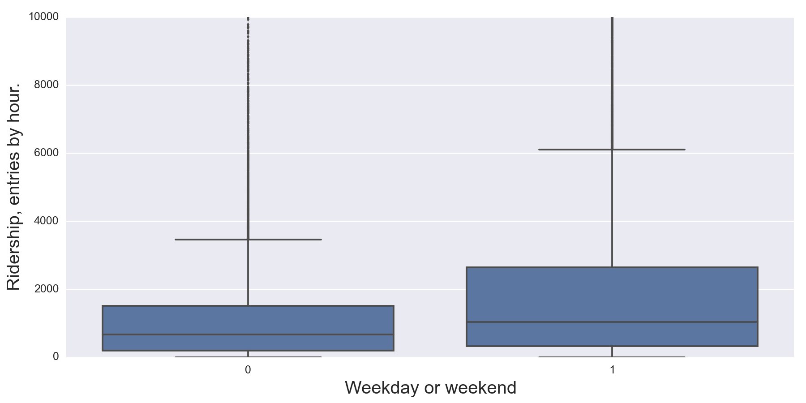
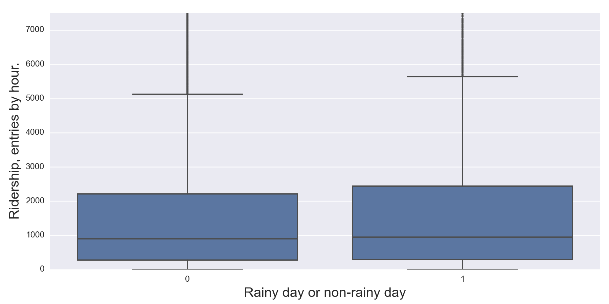
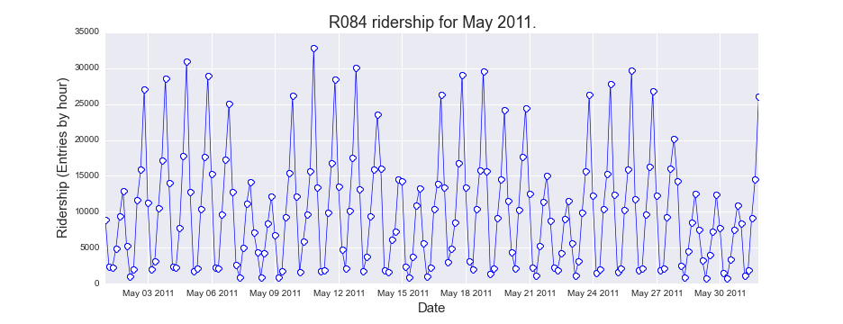
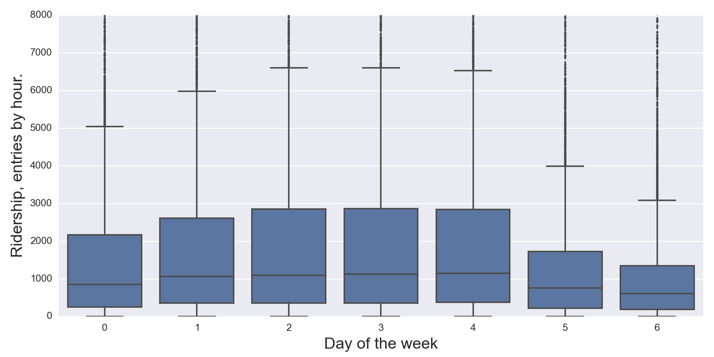
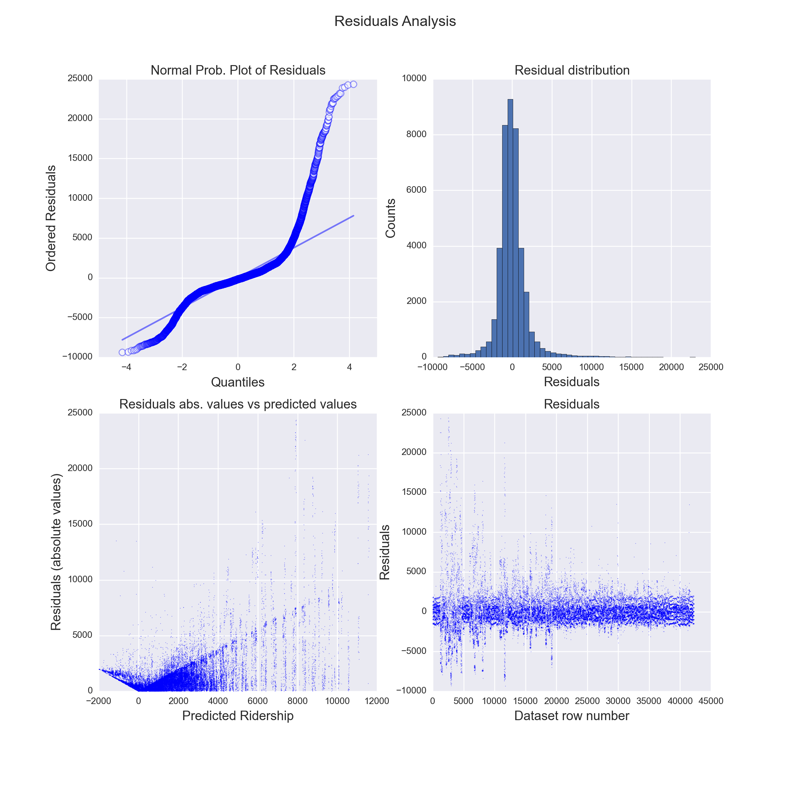
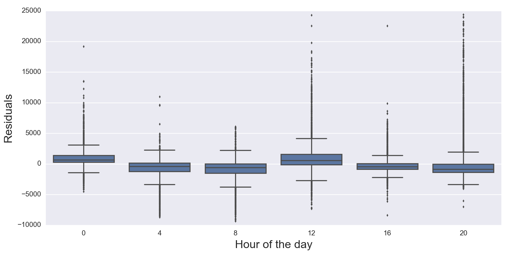
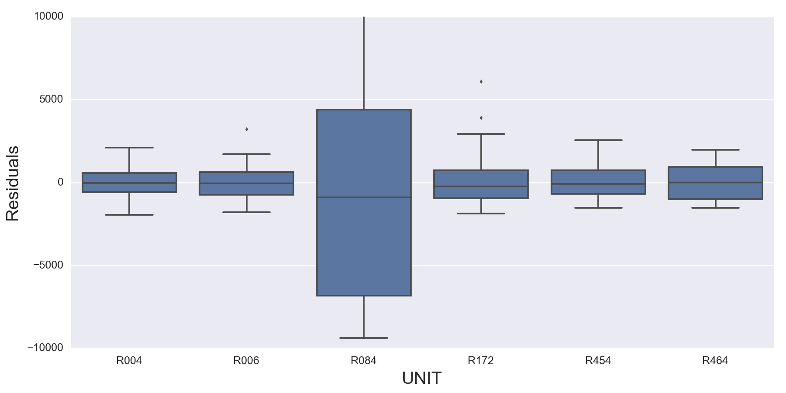
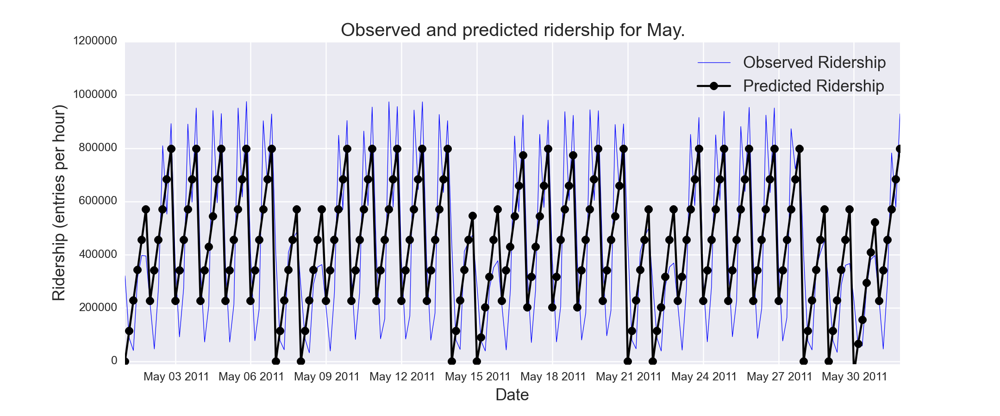
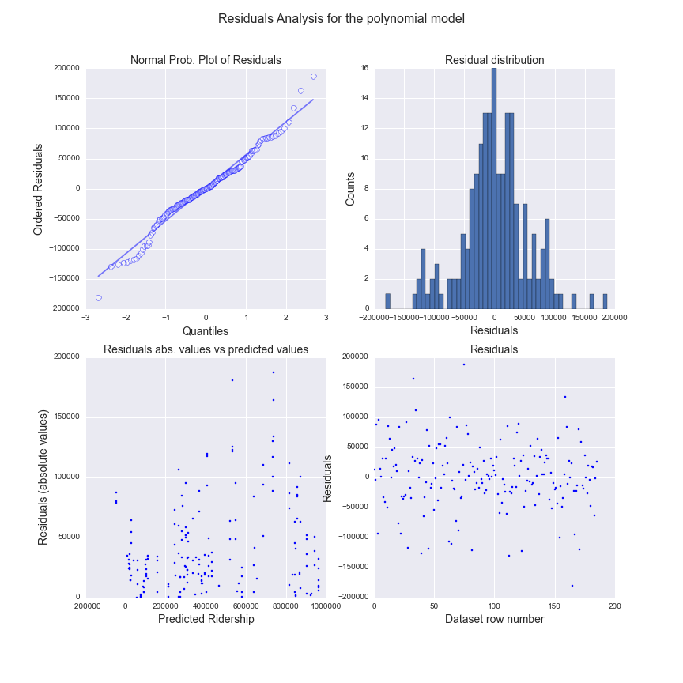
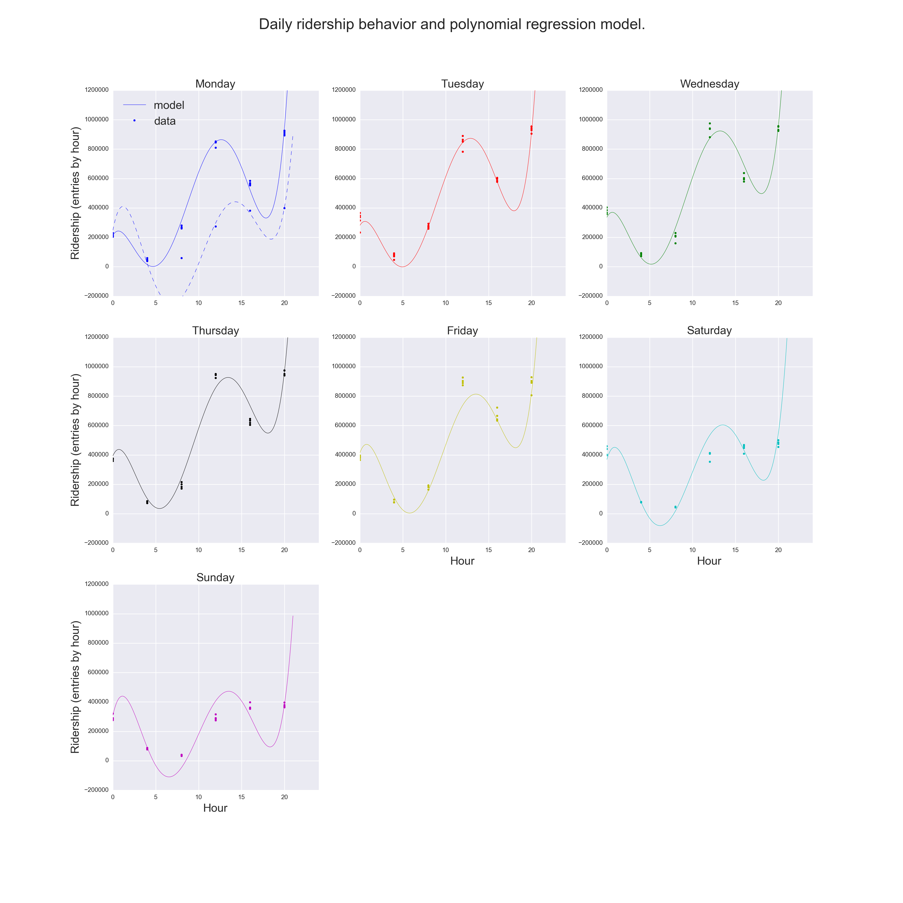

*****************
Linear Regression
*****************

The second part of this work deals with the use of tools related to machine
learning: can we use the data to create models that will allows us to predict
the ridership based on some predicting features?

Problem Set 3 of the class has as one of the main goals the use of a linear
regression model that could help us to predict the ridership in the NYC subway.
We were asked to implement one of the algorithms that calculates the
coefficients of a multiple linear regression model: gradient descent. The
selection of the features, and thus the number of coefficients to fit, was left
as an exercise for the student.

After implementing the linear regression model, and study its strengths and
shortcomings, we used another algorithm to find the coefficients of the linear
regression model: OLS, or ordinary least squares.

Finally, a third method was used, also based on a linear regression algorithm,
but this time the model used higher order polynomials to learn from the data,
in an effort to deal with the nonlinearity of it.

Linear regression algorithm(s)
==============================

**What approach did you use to compute the coefficients theta and produce**
**prediction for ENTRIESn_hourly in your regression model**

Gradient descent
----------------

The code used to implement the gradient descent algorithm to find the linear
regression coefficient can be checked on the python file available at the
github repository associated to this work (``projectone.py``), and on the
submissions to the *Introduction to Data Science* class (problem set 3).

Ordinary Least Squares (with statsmodels)
-----------------------------------------

Selecting the same features as in the Gradient Descent exercise, we calculated
the coefficients of the linear model by using the OLS implementation of the
statsmodels python library [statsmodels]_.

Polynomial features with Ridge linear regression
------------------------------------------------

After analysing the results from the previous regressions, and for reasons that
will become clear after the description of their results, we went a little
further and we used a polynomial transformation of the selected features, and
another linear regression algorithm, the Ridge regression, was used to find the
coefficients and predict ridership. The model used and results will be shown in
the interpretation section.

Models and features used
========================

**What features (input variables) did you use in your model? Did you use any**
**dummy variables as part of your features?**

The selection of the features to use and how to use them in the model was not
a linear process, but an iterative work based on exploratory statistics,
residuals analysis and study of the models obtained to predict the ridership.
In fact, for the problem set 3 in the class we used a different set of variables
as predictors (specifically ``day_week`` instead of ``weekday``).

Also, it was because of these iterative analysis that we decided to give a try
to a third method to model the data which included the use of polynomial
features.

The multiple regression model used for the first two methods can be written as:

.. _multreg_mod:
.. math:: \hat y = \theta_0 + \theta_1 x_1 + theta_2 x_2 + ... + \theta_k x_k
   :label: multreg_mod

where :math:`\hat y` is the predicted variable, :math:`x_i` are the predictors
(features) and :math:`\theta_i` are the coefficients or parameters that we are
looking for using either the gradient descent or the OLS algorithms.

For our work we decided to use the following predictors:

* ``UNIT``: turnstile unique identification. The use of the identification
  of each turnstile starts from the realization that the turnstiles have
  different ridership volumes for the same time periods, as it can be readily
  seen by comparing ridership averages. However this is a non-numerical
  categorical variable, so it was required to transform this variable to a
  numerical format by using dummy variables. This steps adds at once `n` extra
  features or predictors, one for each turnstile in our data, which adds a lot
  of computing work to the algorithm.

* ``hour``: numerical variable that indicates the hour of the day when the
  ridership is reported for each turnstile. This variable can takes values that
  are continuous between 0 and 24, even when in the improved dataset the
  observed values are reported every four hours; it adds one coefficient to
  the calculations. :ref:`Figure 3.1 <figure31>` shows the relation of the
  ridership values with hour the day.

.. _figure31:
.. figure:: hour_rider.png
   :scale: 80%
   :align: center

   Ridership vs hour of the day.

   Instead of just constructing a scatter plot, we decided to use another
   descriptive statistic method to study the relation, if any, between ridership
   and hour of the day. We used boxplots to visualize the distribution of
   ridership for each hour of the day. In this way we can see that the medians
   do not follow a linear relation with the hour of the day, and that there is a
   huge spread of possible ridership values for each hour.

* ``weekday``: numerical (and categorical) variable indicating if the day when
  the ridership measurement was done was either a weekday (1) or weekend day (0).
  :ref:`Figure 3.2 <figure32>` shows the relation of the ridership with kind of
  day.

.. _figure32:

   Ridership vs weekday/weekend-day.

   This plot show the ridership distribution as boxplots for work days (Monday
   to Friday) and weekend days (Saturdays and Sundays). It is clear that even
   when the spread in entries per hour is still big a linear correlation can
   be used.

* ``rain``: daily precipitation condition for a turnstile location (0 for a clear
  day, 1 for rainy). Even when is a categorical variable, it is also numerical,
  and it is used as the final predictor feature for our linear model.
  :ref:`Figure 3.3 <figure33>` shows the relation of the ridership values with
  precipitation conditions.

.. _figure33:

   Ridership vs rainy conditions.

   With the use of boxplots again, we can see in this figure that a really mild
   linear correlation exist between daily precipitation conditions and
   ridership. (Which as was shown in the previous section is not significant).

**Why did you select these features in your model?**

The features were selected based partially on intuition and partially by
exploratory analysis. First, it was clear that the behavior for each individual
turnstile was mainly a function of the hour of the day and the day of the week,
as is shown in :ref:`Figure 3.4 <figure34>`: there is a clear periodicity in the
ridership behavior for each day, depending on the time of the day, and also a
dependence on the day of the week. However the relation is clearly non-linear.
We kept the ``hour`` as a predictor because is an important predictor, an in a
very rough approximation one can see that ridership is lower in the beginning
of the day while reaching a peak on the evenings.

.. _figure34:

   Ridership vs date for turnstile R084.

   The figure clearly shows a periodic behavior for the ridership behavior for
   a particular turnstile, which is a function mainly of the hour of the day and
   day of the week. Ridership peaks are usually seen at 20 hours, while weekends
   and holidays (May 30th) being less busy than weekdays.

However, we decided to use ``weekday`` instead of ``day_week`` (the second being the
day of the week, i.e, a number between 0 and 6, where 0 is Monday and 6 Sunday),
because the major change on ridership behavior is seen between work days and
off days (weekends), and ``weekday`` can be better modeled by a linear model than
``day_week`` (as it can be checked on :ref:`Figure 3.5 <figure35>`)

.. _figure35:

   Ridership vs day of the week.

   This plot show the ridership distribution as boxplots for the 7 days of the
   week (0 is Monday, 6 is Sunday). We can see that even when a relation
   exist between day of the week and ridership, this relation doesn't look
   linear, and thus we decided to use ``weekday`` instead.

Even when ``UNIT`` was not a numerical variable, we decided to use it given the
different ridership patterns for each turnstile location. When using it as
a dummy variable what we will be doing is adding or subtracting a constant
offset which is particular for each location. Will this be enough to model
the behaviors of different stations?

No further experiments where done to try other weather variables, since we were
mainly interested in the behavior of the system as a function of precipitations;
also, no other linear relationships were apparent from these variables, or
there was not enough data to sample the ridership under some conditions (e.g,
only 1 or 2 foggy days, no snow, etc.)

Finally, out from intuition we left out the variable ``EXITSn``: besides having a
highly linearly correlated relation with the ridership variable, it is clear
that this variable is not completely independent from the number of entries to
subway. Furthermore, it won't be a nice predicting feature, since its value
will depend on the number of entries, and it should be treated as a observable
or predictable variable on itself.

Results: coefficients and R Squared
===================================

**What are the coefficients (or weights) of the non-dummy features in your**
**linear regression model?**

**What is your model’s** :math:`R^2` **(coefficients of determination) value?**

The coefficients found with the gradient descent and OLS algorithms were the
same in both cases, which was expected for a successful execution of the
gradient descent algorithm. The selected features were enough to obtain a
:math:`R^2 = 0.481`. More in depth details of the result can be seen in
:ref:`Table 3.1 <table31>`. Also, thanks to the statsmodels OLS implementation
we can report some of the coefficients obtained from the linear model fit,
using the predictor variables ``hour``, ``weekday``, ``rain`` and dummies from
``UNIT`` (:ref:`Eq. 3.1 <multreg_mod>`), and their statistical significances
(:ref:`Table 3.2 <table32>`).

.. _table31:
.. table:: OLS Regression Results

   =====================================  =========================================
   OLS Regression Results
   =====================================  =========================================
   Dep. Variable:        ENTRIESn_hourly   R-squared:                       0.481
   Model:                            OLS   Adj. R-squared:                  0.478
   Method:                 Least Squares   F-statistic:                     163.1
   Date:                Wed, 07 Jan 2015   Prob (F-statistic):               0.00
   Time:                        14:12:52   Log-Likelihood:            -3.8397e+05
   No. Observations:               42267   AIC:                         7.684e+05
   Df Residuals:                   42027   BIC:                         7.705e+05
   Df Model:                         239
   Covariance Type:            nonrobust
   =====================================  =========================================

.. _table32:
.. csv-table:: Linear regression coefficients
   :header: Predictor,coef,std err,t,P>|t|,[95% Conf. Int.]
   :widths: 15, 10, 10, 10, 10, 20
   :stub-columns: 1

   **Intercept**  ,-1750.5171,  166.661,  -10.503, 0.000,-2077.175 -1423.859
   C(UNIT)[T.R004],  334.1581,  231.108,    1.446, 0.148, -118.819   787.135
   C(UNIT)[T.R005],  335.0522,  232.095,    1.444, 0.149, -119.859   789.963
   C(UNIT)[T.R006],  451.3319,  229.532,    1.966, 0.049,    1.445   901.218
   C(UNIT)[T.R007],  164.5844,  232.767,    0.707, 0.480, -291.644   620.812
   ...            ,       ...,      ...,      ...,   ...,      ...       ...
   **hour**       ,  124.0989,    1.500,   82.741, 0.000,  121.159   127.039
   **weekday**    ,  980.9091,   23.243,   42.203, 0.000,  935.353  1026.465
   **rain**       ,   36.3145,   25.167,    1.443, 0.149,  -13.013    85.642

Interpretation and limits
=========================

**What does this** :math:`R^2` **value mean for the goodness of fit for your regression**
**model? Do you think this linear model to predict ridership is appropriate for**
**this dataset, given this** :math:`R^2` **value?**

Even when a relatively high :math:`R^2` was achieved by the use of a multiple
linear regression model, a successful model should also comply with several
assumptions, which can be checked by analysing the residuals [Diez2012]_.

1. **Are the residuals for the model nearly normal?**:
   :ref:`figure 3.6 top rows <figure36>`, shows that the residuals obtained do
   not seem to follow a normal distribution. Even when the peak of the residuals
   tend to be zero, the wings do not follow a Gaussian distribution, as is more
   easily seen on the top left plot. Most probably, we have a big number of
   outliers.

.. _figure36:

   Residuals analysis plots for the linear regression model (improved dataset).

   *Top left:* normal probability plot of the residuals and *top right:* residuals
   distribution. It is clear that residuals do not adjust well to a simple normal
   probability distribution. *Bottom left* shows the residuals versus the
   predicted ridership, and *bottom right* just the residuals following the order
   on which the observed values were found on the improved dataset.

2. **Is the variability of the residuals nearly constant?**: the variance of the
   residuals can be checked on the bottom left plot of :ref:`figure 3.6 <figure36>`,
   where the residuals vs predicted values are plotted. The figure doesn't show
   a constant variance along the x axis, with a lot of features that might be
   related to a poorly fit.

3. **Are the residuals independent?**: a plot of the residuals in the order of the
   data collected in the original data frame should show no relation between
   close neighbours. Our data frame mix data from several turnstiles, but it is
   ordered in such way that all data from the turnstiles can be found on sequenced
   blocks, where the data is again ordered by date and time. From the bottom right
   plot on :ref:`figure 3.6 <figure36>` it seems that the residuals do not look
   independent between different turnstiles.

4. **Is each variable linearly related to the outcome?**: we can check the linearity
   from the figures presented in section 3.2; also the reader can check some
   other figures withing the ipython notebook associated to this project. It has
   been already established that there is a linear relation between ridership and
   the variables ``weekday`` and ``rain``; however there is a poor relation with
   the ``hour`` variable (:ref:`figure 3.7 <figure37>`). However, there are some
   issues raised given the way the ``UNIT`` variable was included in the model,
   and that can be seen in the plots shown in :ref:`figure 3.8 <figure37>`
   and :ref:`figure 3.9 <figure39>`.

.. _figure37:

   Residuals (as boxplots) vs hour of the day.

.. _figure38:

   Residuals (as boxplots) for different turnstiles.

.. _figure39:
.. figure:: turns_pred.png
   :scale: 90%
   :align: center

   Observed and predicted ridership values for three different turnstiles.

   The turnstiles used were R084, R172 and R338, one at downtown and the other
   two at the periphery. The predicted values come from the linear regression
   model applied in previous section. Note how besides the middle panel, the
   model predictions do not follow well the observed ridership for stations with
   too much traffic or low traffic. Also, because of the way the ``UNIT`` dummy
   variables are used, we can see that just adding a constant is not enough to
   scale the ridership for individual locations.

Besides the mild coefficient of determination it seems that many of the
assumptions are not met by our data to successfully apply a multiple regression
model to it. The residuals analysis are very good indicators of the behaviors of
the ridership that the model can't explain, mainly because it was a very rough
assumption to use ``hour`` as it is clearly not well modeled by the linear
regression (:ref:`figure 3.7 <figure37>`). :ref:`Figure 3.9 <figure39>` is also
a nice diagnosis tool to show that using the turnstiles names as dummy variables
can help to improve the fit to the model, but is not enough. From the figure we
can see again that the ridership varies from location to location, with peaks
and valley hours happening at different times of the day for different
turnstiles. Our model only corrects each turnstile by adding or subtracting a
constant to each turnstile, which is not enough to model the ridership of the
different locations. We also found that given the negative value of the
intercept coefficient and small values for some turnstile coefficients we have
several ridership predictions that are negative: this is meaningless for our
problem, since is doesn't make sense a negative ridership.

Finally, it is interesting to independently check that even when the ``rain``
variable can be fit by a linear model, it significance is very low as can be
seen by the low p-value of the coefficient: 0.15. In fact, removing ``rain`` as
predictor feature only reduce the :math:`R^2` by less than 0.0001, and the
reported coefficient of determination is still 0.481.

Aggregated dataset and polynomial features
------------------------------------------

We will now take advantage to the extra wrangling done with the improved data
set in the previous chapter, and we will use the smoothed dataset that we
created: **nycsubway_weather**. This data set was created by aggregating the
ridership for each time stamp by adding all the ridership of the individual
turnstiles, so we have a dataset that reports the ridership of the NYC subway as
a whole. The columns of this dataset are:

* ENTRIESn_hourly: the total ridership as entries per hour for the whole NYC
  subway system

* dateTime: ``datetime`` variable, is the date and time for each observed value.

* hour: integer value, is the hour of the day for each reported value. It has a
  24 hour format.

* day_week: integer value, is the day of the week for the observation (0 for
  Monday, 6 for Sunday)

* weekday: indicator variable, 1 for a weekday, 0 for a weekend day.

* holiday: categorical variable, 1 for days that are holidays.

* rain_hour: indicator variable, it reports whether at any location within the
  NYC Subway system was raining at the particular time

* rain_day: indicator variable, it reports whether at any location in the NYC
  Subway system there wa any precipitation (rain) for the particular day of the
  reported value.

After some tries with multiple regression models, using the OLS statsmodels
implementation, we were able to raise the :math:`R^2` value to 0.563 using this
new dataset and three predicting variables: ``hour``, ``weekday`` and ``holiday``.
Neither ``rain_day`` nor ``rain_hour`` improved the coefficient of determination
noticeably, with p-values higher than 0.61. Even with the smoothing achieved
by the removal of individual turnstiles we were able to see the same kinds of
problems as described previously, being the most important factor the
nonlinearity of the relation between the hour of the day and ridership, plus the
difference in this relation for different days of the week: having a constant
added (or subtracted) given the type of day (weekday or day off) is not enough
to account for the variations seen between days.
:ref:`Figure 3.10 <figure310>` shows a plot with the observed and predicted
values, which further explains the shortcoming of using a linear model with our
data. The reader can also check the ipython notebook associated with this
project to look for the residuals analysis.

.. _figure310:

   Observed and predicted ridership values for the NYC Subway, month of May.

   Even when we have eliminated the complexities by taking the whole NYC Subway
   as a whole and increased the percentage of the ridership behavior for May
   2011 that is explained but the used linear model, is still apparent the
   problems produced by the lack of linearity of ``hour`` vs ridership, and the
   changes in ridership behavior for different days of the week.

Because of these reasons we decide to try a different method. This method is still
an algorithm that uses the linear regression tools, but the predictors are now
converted into *polynomial features* [glmscikit]_. The problem can be resolved with
a linear regression by taking advantage of the linearity of the coefficients in
the system of equations needed to solve the problem of finding these coefficients.
The function used to convert our selected predictors, that for this optional exercise
will be ``hour``, ``day_week``, ``holiday`` and ``rain_hour``, was the library
``PolynomialFeatures`` from the scikit-learn libraries for machine learning with
python. We won't enter into the details of this method, since it goes beyond
the goal of this project, but it suffice to say here that the new model is now
a polynomial of degree 5 (that was our selection), were the predictors also interact
with each other. So, if :math:`x_1 = \rm{hour}`, :math:`x_2 = \rm{day_week}`,
:math:`x_3 = \rm{holiday}` and :math:`x_3 = \rm{rain\_hour}`, the model we are
trying to use to explain our data is going to be of the form:

.. math:: \hat{y} = \theta_0 + \theta_1 x_1 + \theta_2 x_1^2 + ... + \theta_5 x_1^5 +
   \theta_6 x_2 +...+ \theta_n x_1 x_2 + \theta_{n+1} x_1 x_3 + ...

Also, we mentioned that we used a Ridge regression algorithm, that was suggested
by the scikit-learn documentation as a more robust method to find the coefficients
in a model like the one we are trying to use.

The main idea was to try to overcome the limitation given for the non-linearity
of the hourly and daily ridership in our NYC subways system set. The improvement
was amazing, by reaching a :math:`R^2 = 0.968`, and the reader can check the
residual analysis plots in :ref:`Figure 3.11 <figure311>`.

.. _figure311:

   Residuals analysis plots for the polynomial model (nycsubway_weather dataset).

   *Top left:* normal probability plot of the residuals and *top right:* residuals
   distribution. The residuals are distributed now following more closely the shape
   of a Gaussian, and less outliers are visible; *Bottom left* shows the residuals
   versus the predicted ridership, and *bottom right* just the residuals following
   the order on which the observed values are reported.

Even when (a) the residual distribution is now closer to a normal distribution,
(b) the variance seems to be more constant and (c) the residuals seem
independent, we must draw the attention to the reader to the fact that this
model, while an improvement, still have shortcomings, that can be seen in
:ref:`Figure 3.12 <figure312>`. While the hourly and daily ridership are now
modeled with higher precision we have to be aware of the overfitting our model
is suffering of, explained by the large number of coefficients to be found
(126 coefficients). However, it is clear that a much better work can be done
with more complex machine learning algorithms, and the idea was just to show
that with the data we have we should be able to predict ridership with much more
accuracy than the linear regression is capable of.

.. _figure312:

   Observed and predicted ridership values for days of the week as a function of
   hour.
