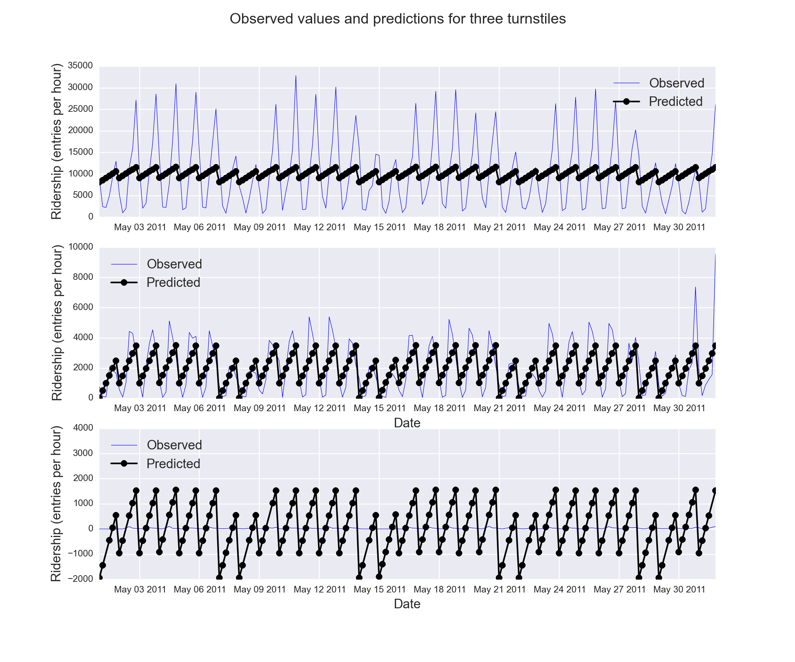

*****************
Linear Regression
*****************

The second part of this work deals with the use of tools related to machine
learning: can we use the data to create models that will allows us to predict
the ridership?

Problem Set 3 of the class has as one of the main goals the use of a linear
regression model that could help us to predict the ridership in the NYC subway.
We were asked to implement one of the algorithms that calculates the coefficients
of a multiple linear regression model: gradient descent. The selection of the
features, and thus the number of coefficients to fit, was left as an exercise
for the student.

After implementing the linear regression model, and study its strengths and
shortcomings, we used another algorithm to find the coefficients of the linear
regression model: OLS, or ordinary least squares.

Finally, a third method was used, also based on a linear regression algorithm,
but this time the model used higher order polynomials to learn from the data,
in an effort to fit the non-linearity of it.

Linear regression algorithm(s)
==============================

Gradient descent
----------------

The code used to implement the gradient descent algorithm to find the linear
regression coefficient can be checked on the python file available at the
github repository associated to this work, and on the submissions to the
*Introduction to Data Science* class (problem set 3).

Ordinary Least Squares (with statsmodels)
-----------------------------------------

Selecting the same features as in the Gradient Descent exercise, we calculated
the coefficients of the linear model by using the OLS implementation of the
statsmodels python library.

Polynomial features with Ridge linear regression
------------------------------------------------

After analysing the results from the previous regressions, and for reasons that
will be clear after the description of their results, we went a little further
and we used a polynomial transformation of the selected features, and another
linear regression algorithm, the Ridge regression, was used to model the data
and predict ridership. The model used and results will be shown in the
interpretation section.

Models and features used
========================

The selection of the features to use and how to use them in the model was not
a linear process, but an iterative work based on exploratory statistics, residuals
analysis and study of the models obtained to predict the ridership. If fact,
for the problem set 3 in the class we used a different set of variables as
predictors (specifically `day_week` instead of `weekday`).

Also, because of these iterative analysis we decided to also give a try to a
third method to model the data, which was the use of polynomial features.

The multiple regression model used for the first two methods can be written as:

.. _multreg_mod:
.. math:: \hat y = \theta_0 + \theta_1 x_1 + theta_2 x_2 + ... + \theta_k x_k
   :label: multreg_mod

where :math:`\hat y` is the predicted variable, :math:`x_i` are the predictors
(features) and :math:`\theta_i` are the coefficients or parameters that we are
looking for using either the gradient descent or the OLS algorithms.

For our work, we decided to use the following predictors:

* `UNIT`: turnstile unique identification. The use of the identification
  of each turnstile starts from the realization that the turnstiles have different
  ridership volumes for the same time periods, as it can be readily seen by
  comparing ridership averages. However this is a non-numerical categorical
  variable, so it was required to transform this variable to numerical format
  by using dummy variables. This steps adds at once `n` extra features or predictors,
  one for each turnstile in our data, which adds a lot of computing work to the
  algorithm.

* `hour`: numerical variable that indicates the hour of the day when the ridership
  was reported for each turnstile. This variable takes values that can be continuous
  between 0 and 24; it adds one coefficient to calculate. :ref:`Figure 3.1 <figure31>`
  shows the relation of the ridership values with hour the day.

.. _figure31:
.. figure:: hour_rider.png
   :scale: 80%
   :align: center

   Ridership vs hour of the day.

   Instead of just constructing a scatter plot, we decided to use another descriptive
   statistic method to study the relation, if any, between ridership and hour of
   the day. We used boxplots to visualize the distribution of ridership for each
   hour of the day. In this way we can see that the medians do not follow a
   linear relation with the hour of the day, and that there is a huge spread
   of possible ridership values for each hour.

* `weekday`: numerical (and categorical) variable indicating if the day
  when the ridership measurement was done was either a weekday (1) or weekend
  day (0). :ref:`Figure 3.2 <figure32>`
  shows the relation of the ridership with kind of day.

.. _figure32:
.. figure:: weekday_rider.png
   :scale: 80%
   :align: center

   Ridership vs weekday/weekend-day.

   This plot show the ridership distribution as boxplots for work days (Monday to
   Friday) and weekend days (Saturdays and Sundays). It is clear that even
   when the spread in entries per hour is still big a linear correlation can
   be used.

* `rain`: daily precipitation condition for a turnstile location (0 for a clear
  day, 1 for rainy). Even when is a categorical variable, it is also numerical,
  and it is used as the final predictor feature for our liner model.
  :ref:`Figure 3.3 <figure33>` shows the relation of the ridership values with
  precipitation conditions.

.. _figure33:
.. figure:: rain_rider.png
   :scale: 80%
   :align: center

   Ridership vs rainy conditions.

   With the use of boxplots again, we can see in this figure that a really mild
   linear relation exist for the relation between daily precipitation conditions
   and ridership. (Which as was shown in the previous section is not significant)

The features were selected based partially on intuition and partially by exploratory
analysis.

First, it was clear that the behavior, for each individual turnstile, was mainly
a function of the hour of the day and the day of the week, as is shown in
:ref:`Figure 3.4 <figure34>`: there is a clear periodicity in the ridership
behavior for each day, depending on the time of the day, and also a dependence
on the day of the week. However the relation is clearly non-linear. We kept the
`hour` as a predictor because is an important predictor, an in a very rough way
one can see that ridership is lower in the beginning of the day while reaching
a pick on the evenings.

.. _figure34:

   Ridership vs date for turnstile R084.

   The figure clearly shows a periodic behavior for the ridership behavior for
   a particular turnstile, which is a function mainly of the hour of the day and
   day of the week. Ridership picks are usually seen at 20 hours, while weekends
   and holidays (May 30th) being less busy than weekdays.

However, we decided to use `weekday` instead of `day_week` (the second being the
day of the week, i.e, a number between 0 and 6, where 0 i Monday and 6 Sunday),
because the major change on ridership behavior is seen between work days and
off days (weekends), and `weekday` can be better modeled by a linear model than
`day_week` (as it can be checked on :ref:`Figure 3.5 <figure35>`)

.. _figure35:

   Ridership vs day of the week.

   This plot show the ridership distribution as boxplots for the 7 days of the
   week (0 is Monday, 6 is Sunday). We can see that even when a relation
   exist between day of the week and ridership, this relation doesn't look
   linear, and thus we decided to use `weekday` instead.

Results: coefficients and R Squared
===================================

The coefficients found with the gradient descent and OLS algorithms were the
same in both cases, which was expected for a successful execution of the
gradient descent algorithm. The selected features were enough to obtain a
:math:`R^2 = 0.481`. More in depth details of the result can be seen in
:ref:`Table 3.1 <table31>`. Also, thanks to the statsmodels OLS implementation
we can report some of the coefficients obtained from the linear model fit,
using the predictor variables `hour`, `weekday`, `rain` and dummies from `UNIT`
(:ref:`Eq. 3.1 <multreg_mod>`), and their statistical significances
(:ref:`Table 3.2 <table32>`).

.. _table31:
.. table:: OLS Regression Results

   =====================================  =========================================
   OLS Regression Results
   =====================================  =========================================
   Dep. Variable:        ENTRIESn_hourly   R-squared:                       0.481
   Model:                            OLS   Adj. R-squared:                  0.478
   Method:                 Least Squares   F-statistic:                     163.1
   Date:                Wed, 07 Jan 2015   Prob (F-statistic):               0.00
   Time:                        14:12:52   Log-Likelihood:            -3.8397e+05
   No. Observations:               42267   AIC:                         7.684e+05
   Df Residuals:                   42027   BIC:                         7.705e+05
   Df Model:                         239
   Covariance Type:            nonrobust
   =====================================  =========================================

.. _table32:
.. csv-table:: Linear regression coefficients
   :header: Predictor,coef,std err,t,P>|t|,[95% Conf. Int.]
   :widths: 15, 10, 10, 10, 10, 20
   :stub-columns: 1

   **Intercept**  ,-1750.5171,  166.661,  -10.503, 0.000,-2077.175 -1423.859
   C(UNIT)[T.R004],  334.1581,  231.108,    1.446, 0.148, -118.819   787.135
   C(UNIT)[T.R005],  335.0522,  232.095,    1.444, 0.149, -119.859   789.963
   C(UNIT)[T.R006],  451.3319,  229.532,    1.966, 0.049,    1.445   901.218
   C(UNIT)[T.R007],  164.5844,  232.767,    0.707, 0.480, -291.644   620.812
   ...            ,       ...,      ...,      ...,   ...,      ...       ...
   **hour**       ,  124.0989,    1.500,   82.741, 0.000,  121.159   127.039
   **weekday**    ,  980.9091,   23.243,   42.203, 0.000,  935.353  1026.465
   **rain**       ,   36.3145,   25.167,    1.443, 0.149,  -13.013    85.642

Interpretation and limits
=========================

Even when a relatively high :math:`R^2` was achieved by the use of a multiple
linear regression model, a successful model should also comply with several
assumptions, which can be checked by analysing the residuals.

1. **Are the residuals for the model nearly normal?**:
   :ref:`figure 3.6 top rows <figure36>`, shows that the residuals obtained do
   not seem to follow a normal distribution. Even when the pick of the residuals
   tend to be zero, the wings do not follow a Gaussian distribution, as is more
   easily seen on the top left plot. Most probably, we have a big number of
   outliers.

.. _figure36:

   Residuals analysis plots for the linear regression model (improved dataset).

   *Top left:* normal probability plot of the residuals and *top right:* residuals
   distribution. It is clear that residuals do not adjust well to a simple normal
   probability distribution. *Bottom left* shows the residuals versus the
   predicted ridership, and *bottom right* just the residuals following the order
   on which the observed values were found on the improved dataset.

2. **Is the variability of the residuals nearly constant?**: the variance of the
   residuals can be checked on the bottom left plot of :ref:`figure 3.6 <figure36>`,
   where the residuals vs predicted values are plotted. The figure doesn't show
   a constant variance along the x axis, with a lot of features that might be
   related to a poorly fit.

3. **Are the residuals independent?**: a plot of the residuals in the order of the
   data collected in the original data frame should show no relation between
   close neighbours. Our data frame mix data from several turnstiles, but it is
   ordered in such way that all data from the turnstiles can be found on sequenced
   blocks, where the data is again ordered by date and time. From the bottom right
   plot on :ref:`figure 3.6 <figure36>` it seems that the residuals do not look
   independent between different turnstiles.

4. **Is each variable linearly related to the outcome?**: we can check the linearity
   from the figures presented in section 3.2; also the reader can check some
   other figures withing the ipython notebook associated to this project. It has
   been already established that there is a linear relation between ridership and
   the variables `weekday` and `rain`; however there is a poor relation with
   the `hour` variable (:ref:`figure 3.7 <figure37>`). However, there are some
   issues raised given the way the `UNIT` variable was included in the model,
   and that can be seen in the plots shown in :ref:`figure 3.8 <figure37>`
   and :ref:`figure 3.9 <figure39>`.

.. _figure37:

   Residuals (as boxplots) vs hour of the day.

.. _figure38:

   Residuals (as boxplots) for different turnstiles.

.. _figure39:

   Observed and predicted ridership values for three different turnstiles.

   The turnstiles used were R084, R172 and R338, one at downtown and the other two
   at the periphery. The predicted values come from the linear regression model applied
   in previous section. Note how besides the middle panel, the model predictions do
   not follow well the observed ridership for stations with too much traffic or low
   traffic. Also, because of the way the `UNIT` dummy variables are used, we can see
   that just adding a constant is not enough to scale the ridership for individual
   locations.

Besides the mild coefficient of determination it seems that many of the assumptions
are not met by our data to successfully apply a multiple regression model to it. The
residuals analysis are very good indicators of the behaviors of the ridership that the
model can't explain, mainly because it is a very rough assumption to use `hour` as it is
clearly not well modeled by the linear regression (:ref:`figure 3.7 <figure37>`).
:ref:`Figure 3.9 <figure39>` is also a nice diagnosis tool to
show that using the turnstiles names as dummy variables can help to improve the fit to
the model, but is not enough. From the figure we can see again that the ridership varies
from location to location, with picks and valley hours happening at different times of
the day for different turnstiles. Our model only corrects each turnstile by adding or
subtracting a constant to each turnstile, which is not enough to model the ridership
of the different locations. We also found that given the negative value of the intercept
coefficient and small values for some turnstile coefficients we have several ridership
predictions that are negative: this is meaningless for our problem, since is doesn't make
sense a negative ridership.

Finally, it is interesting to independently check that even when the `rain` variable can
be fit by a linear model, it significance is very low as can be seen by the low p-value
of the coefficient: 0.15. In fact, removing `rain` as predictor feature only reduce the
:math:`R^2` by less than 0.0001, and the reported coefficient of determination is
still 0.481.

Aggregated dataset and polynomial features
------------------------------------------

We will know take advantage to the extra wrangling done with the improved data set in the
previous chapter, and we will use the smoothed dataset that we created:
**nycsubway_weather**. This data set was created by aggregating the ridership for each time
stamp by adding all the ridership of the individual turnstiles, so we have a dataset
that reports the ridership of the NYC subway as a whole. The columns of this dataset are

* ENTRIESn_hourly: the total ridership as entries per hour for the whole NYC subway
  system

* dateTime: `datetime` variable, is the date and time for each observed value.

* hour: integer value, is the hour of the day for each reported value. It has a 24 hour
  format.

* day_week: integer value, is the day of the week for the observation (0 for Monday, 6 for
  Sunday)

* weekday: indicator variable, 1 for a weekday, 0 for a weekend day.

* holiday: categorical variable, 1 for days that are holidays.

* rain_hour: indicator variable, it reports whether at any location within the NYC Subway
  system was raining at the particular time

* rain_day: indicator variable, it reports whether at any location in the NYC Subway system
  there wa any precipitation (rain) for the particular day of the reported value.

