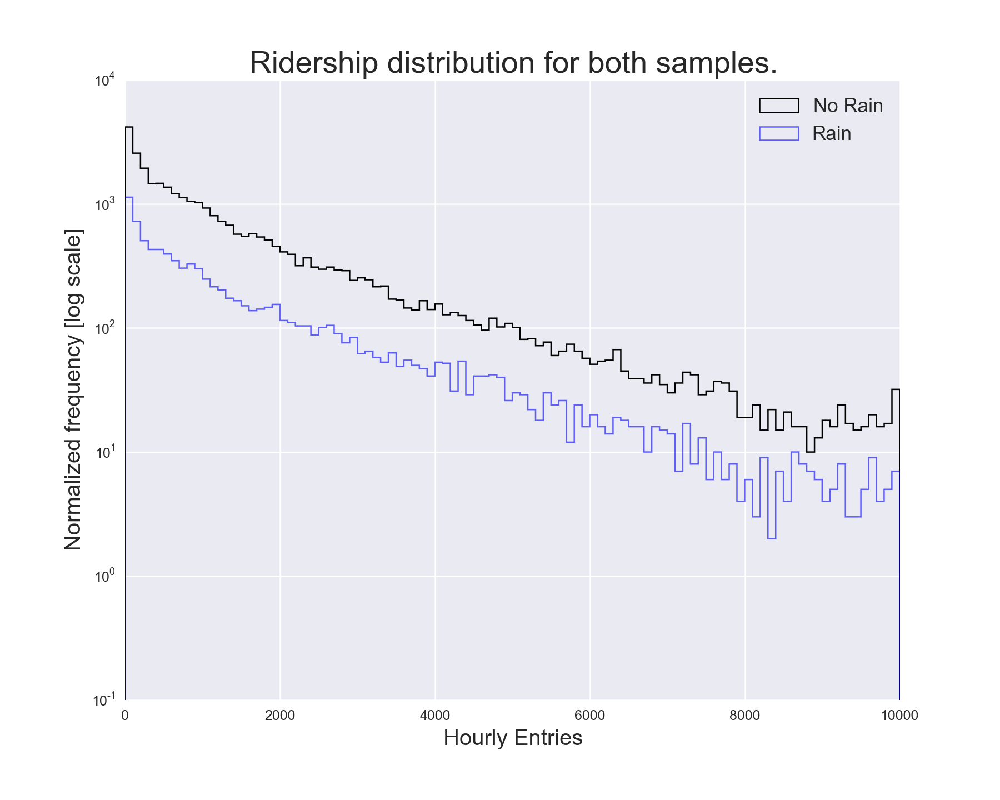
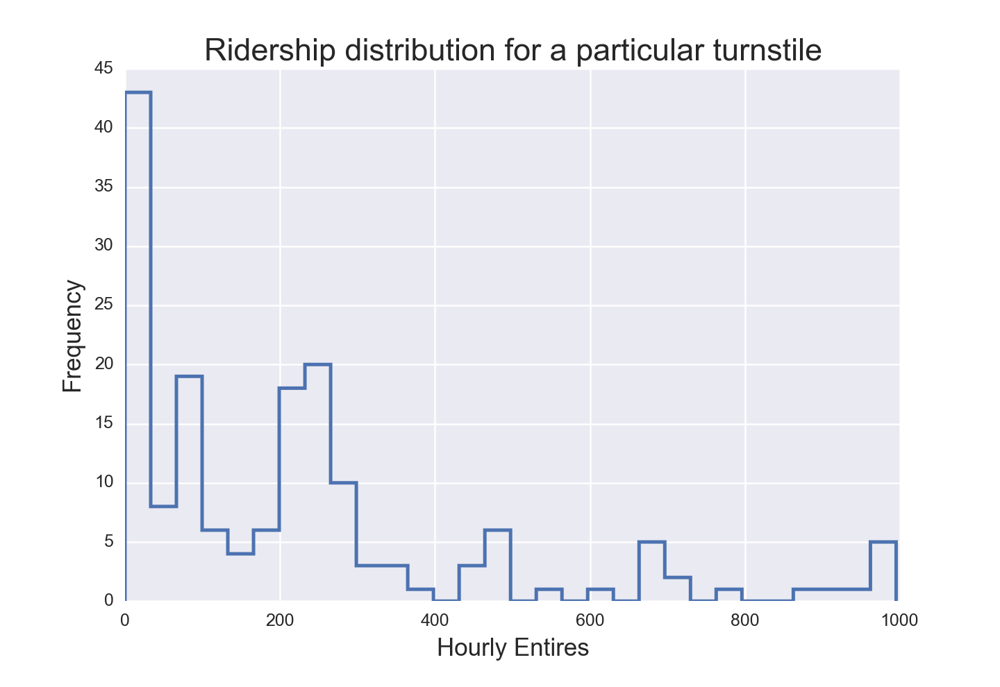
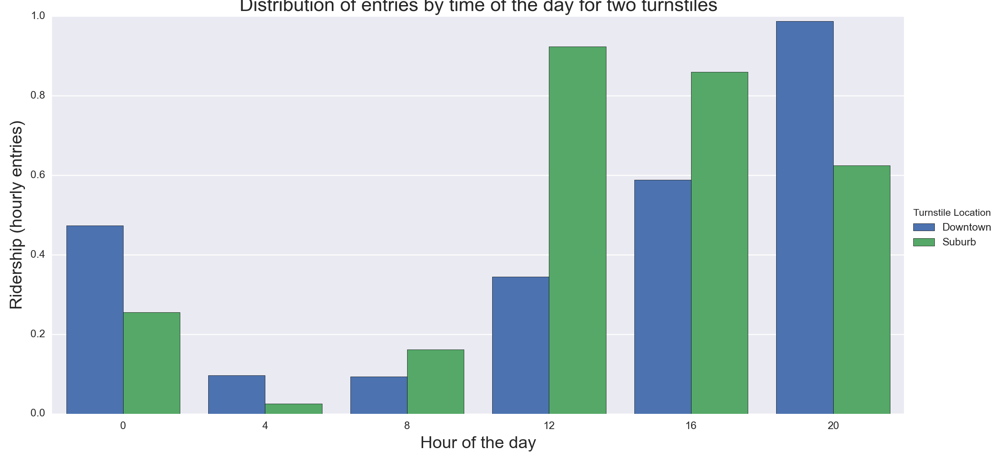
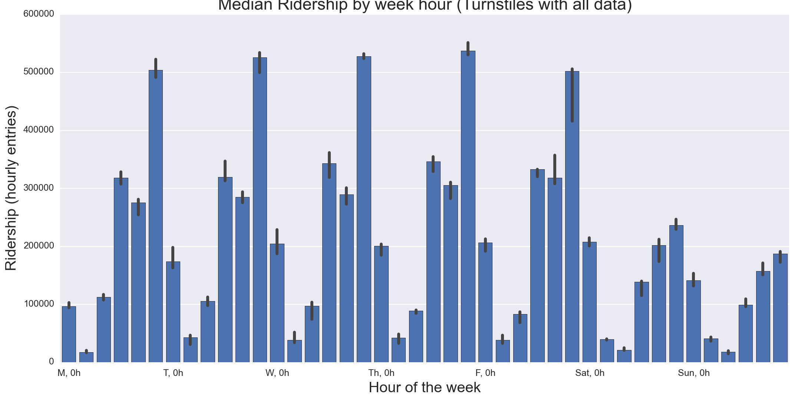
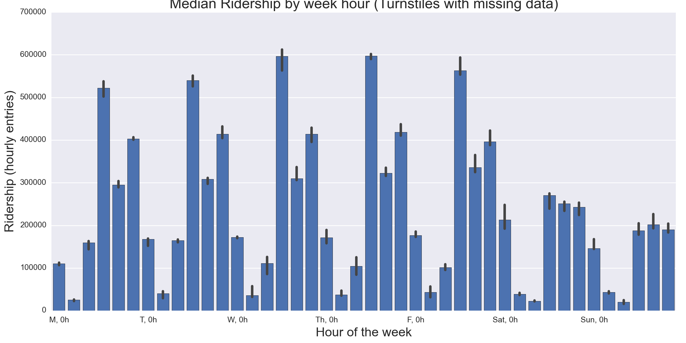
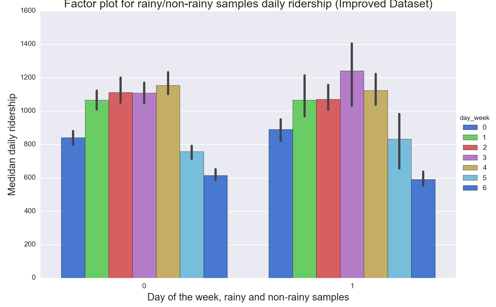
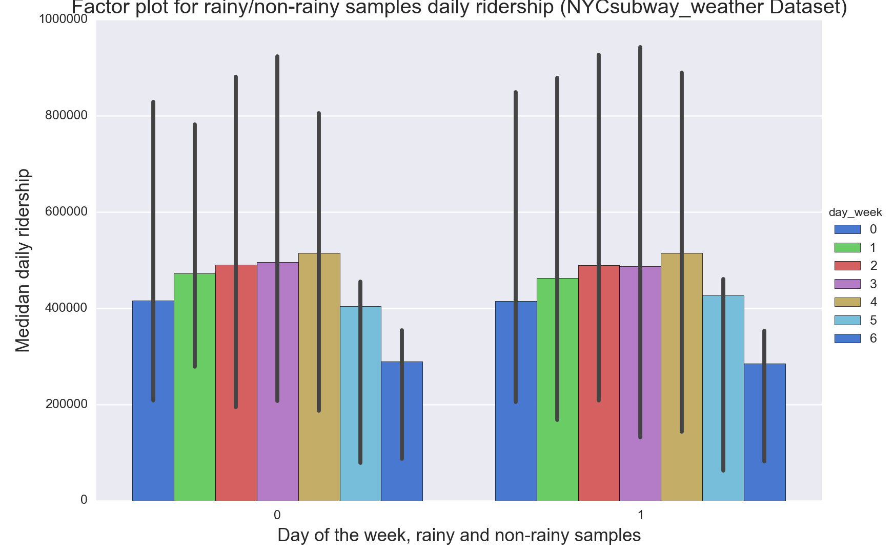
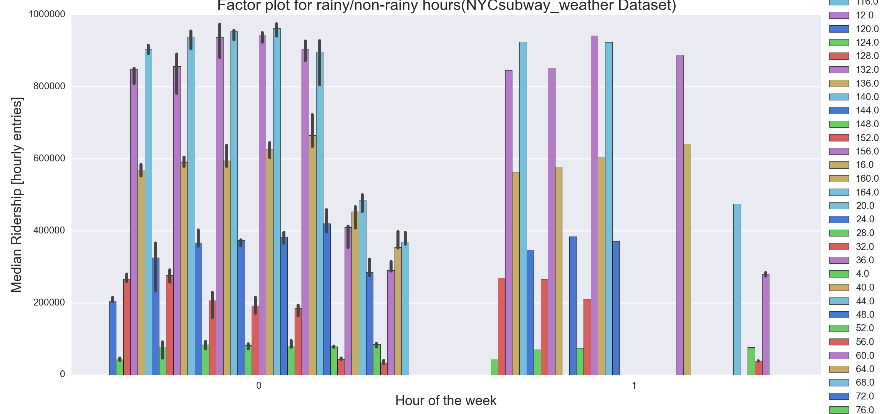

*************
Visualization
*************

Ridership distribution with weather
===================================

**One visualization should contain two histograms: one of  ENTRIESn_hourly for**
**rainy days and one of ENTRIESn_hourly for non-rainy days.**

The figure comparing the ridership distributions for rainy and non-rainy days
has been already presented in the Chapter 2. Here (:ref:`figure 4.1 <figure42>`)
we show the same figure, but this time we want to show the different samples sizes
by not normalizing the data.

.. _figure41:

   Ridership distribution comparison between rainy and dry days.

   Please note the logarithmic scale on axis Y. It was used to allows us to
   study the visualization with more detail. Both distributions are similar in
   shape, but the rainy sample is smaller than the rain sample (there was
   precipitation reported for only 7 days of May 2011), and thus the counts
   by bin are smaller.

Supporting visualizations
=========================

**One visualization can be more freeform.**

We will shown here some of the other plots that were created while working on
this project, and that help to answer particulars questions we have, or to
explore the data. All the code that produced these plots can be found on the
accompanying IPython notebook.

.. _figure42:

   Ridership distribution for one turnstile.

   With this figure we studied how the ridership distribution looked for the
   data of one turnstile. It looks like there are multiple distributions within
   the data (multiples modes), which correspond to the different distributions
   for a particular hour and day of the week.

.. _figure43:

   Ridership behavior for two different turnstiles

   This plot was created to show the different daily behavior by turnstile
   location, comparing one turnstile at downtown and other at the periphery. The
   y-axis scale was normalized to focus on how different was the use of the
   turnstiles along the day: the downtown locations tend to have a peak
   at 20 hours, while the suburbs peak at noon.

.. _figure44:

   Weekly ridership behavior for turnstiles with no missing data.

   This figure, and the next, were created while studying the actual
   independence of the rainy and non-rainy samples in chapter 2. We noticed
   that several turnstiles within the original dataset didn't report information
   for 1 or several times in May 2011, and we wanted to study what would happen
   if we only worked with the complete turnstiles. We found out that the
   locations with no missing data were mostly at downtown stations, and they
   also represented mostly the busiest locations. Note that daily ridership
   peaks at 20 hours. *Notice that the x-axis includes markers for the 0 hours*
   *of each day of the week, and six reports happen each day, for 0, 4, 8, 12,*
   *16 and 20 hours.*

.. _figure44b:

   Weekly ridership behavior for turnstiles with missing data.

   Same as previous figure, but for data with missing data. Note how the daily
   ridership behaviors changes, with two peaks, one at noon and the other at 20
   hours. If a comparison is done with :ref:`Figure 4.3 <figure43>`, this sample
   is more similar to the suburb station, while the previous sample is closer
   to the behavior of the downtown locations.

.. _figure45:

   Comparison of the daily ridership for non-rainy (0) and rainy (1) samples from
   the improved dataset.

   This plots helps to compares how the ridership volume might be affected by the
   precipitation conditions for each day of the week. Both samples seem too have
   a pretty similar ridership volume for the same days, within the limits shown
   by the 95% confidence intervals (the black vertical lines in each bar)

.. _figure46:

   Comparison of the daily ridership for non-rainy (0) and rainy (1) samples but
   now from the ``nycsubway_weather`` dataset.

   Same as previous figure. The daily ridership volume for both samples look even
   more similar than in the previous plot. One drawback of this new dataset, that
   treats the NYC subway system as a whole, is that we can notice that we do not
   have too many data points to accurately study the ridership, as can be
   seen by the big 95% confidence interval lines. With most days having 4 (and
   some 5) observed values within May 2011, when dividing between rainy and
   non-rainy the number of observations drops even more.

.. _figure47:

   Comparison of the week-hourly ridership volumes for the non-rainy and rainy
   samples from the ``nycsubway_weather`` dataset.

   This figure is similar to the previous two plots, but this time we use the
   ``rain_hour`` indicator to create the two samples. It is clearer now that we
   might have not enough observations to answer the question behind this project,
   does the ridership in the NYC subway changes with the rain conditions? *Note*
   *that the x-axis, for each sample, shows values between 0 and 143, being 0*
   *the 0 hours of Monday, and 143 the 23 hours of Sunday*.